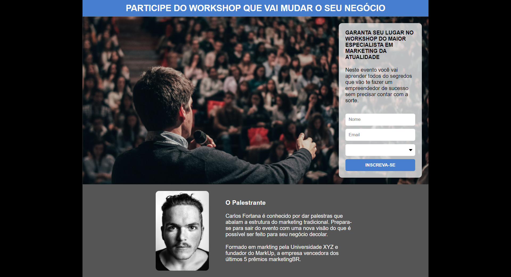
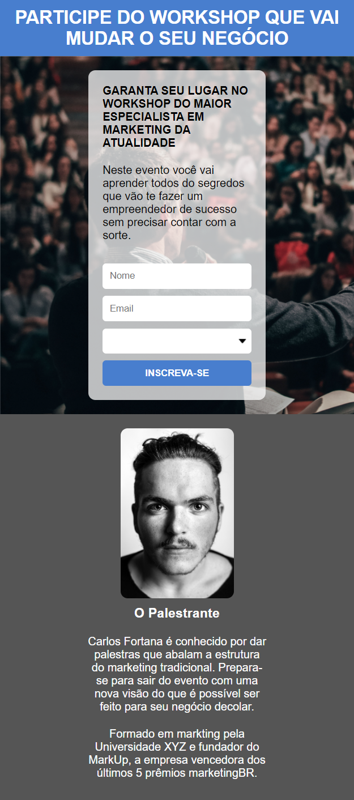

<h1> Pagina de Captura </h1>

<h2>Descrição</h2>

Colocando em prática meu aprendizado no início curso do Prog BR. 
Página simples, estática, porém totalmente responsiva  

<h2>Tecnologias</h2>
<ul>
  <li>HTML</li>
  <li>CSS</li>
</ul>

<h2>Features</h2>
<ul>
  <li>Responsivo</li>
  <li>Flex Box</li>
</ul>

<h2>Preview DESKTOP</h2>
 

  

<h2>Preview MOBILE</h2>
 

  
    

<h2> 
<a href="https://www.linkedin.com/in/mq-soares">Meu Linkedin</a>
</h2>
